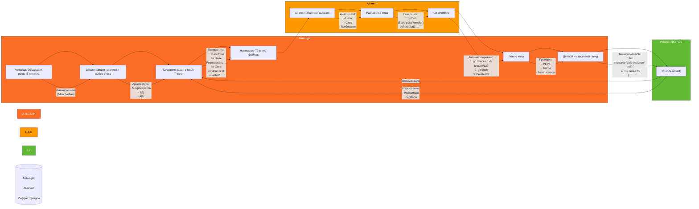
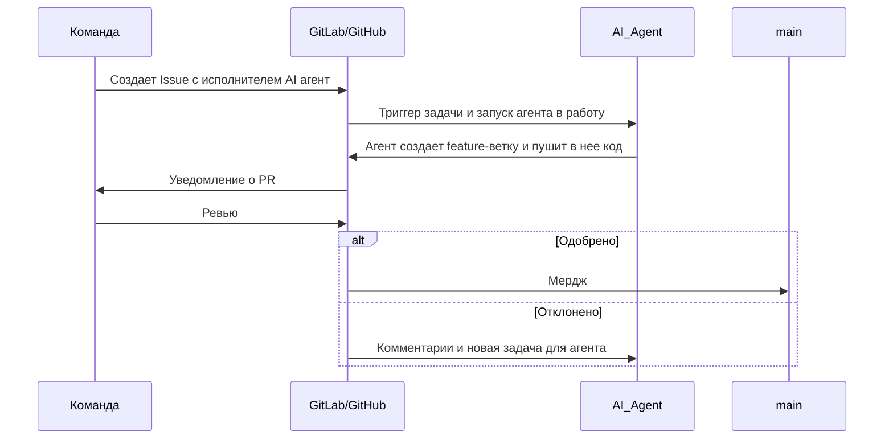

схема жизненного цикла AI-агента в контексте разработки ПО, включая Git-воркфлоу, на языке Mermaid (Markdown-совместимый):




### Пояснение к схеме:
1. **Обсуждение идеи**  
   - Команда определяет задачи агента (например, "Чат-бот для треккинга задач").
2. **Создание задачи в Git**  
   ```markdown
   - Issue #123: "Реализовать AI-агент для анализа текстовых задач"
   - Назначено на: AI-DevBot
   ```
3. **Структура Python-проекта**  
   ```python
   # Пример структуры
   class TaskAnalyzer:
       def __init__(self, model_path: str):
           self.model = load_model(model_path)
       
       def predict(self, text: str) -> str:
           return self.model.generate(text)
   ```
4. **Работа агента**  
   - Автоматическая генерация кода (например, через обращение к API LLM в контуре или за его пределами).
5. **Git-операции**  
   ```bash
   git checkout -b feature/task-number
   git add .
   git commit -m "Добавлены данные относительно Task + Description"
   git push origin feature/task-number
   ```
6. **Ревью кода**  
   - Проверка:
     - Соответствие PEP8.
     - Наличие тестов (`test_agent.py`).
     - Логирование ошибок.
7. **Слияние и деплой**  
   - После апрува — мердж в `main` с дальнейшей выкаткой на тест полигон.

### Дополнительные элементы для Mermaid:


Такой подход:
- Соответствует **Agile/DevOps**-практикам.
- Позволяет отслеживать вклад AI в разработку.
- Автоматизирует code review через инструменты вроде **SonarQube**.