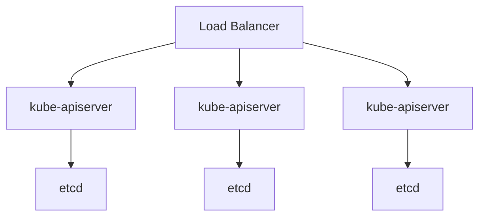

### **🔹 Зачем нужен HA?**

**High Availability (HA)** — это отказоустойчивая архитектура кластера Kubernetes, при которой:
- **Нет единой точки отказа (SPOF)**.
- **Сервисы остаются доступными** даже при падении отдельных нод или компонентов.
- **Автоматическое восстановление** при сбоях (self-healing).
- **Перед кластером размещаем балансировщик нагрузки с несколькими нодами**.

---

## **2. Уровни High Availability в Kubernetes**
### **🔹 1. HA Control Plane (Мастер-ноды)**
Гарантирует, что **API Kubernetes** и управляющие компоненты (`kube-apiserver`, `etcd`, `kube-controller-manager`, `kube-scheduler`) работают без сбоев.

### **🔹 2. HA Worker Nodes (Рабочие ноды)**
Обеспечивает бесперебойную работу **Pod'ов** и **сервисов**:
- Реплики Pod'ов распределены по разным нодам.
- Используются **PodDisruptionBudget (PDB)** для graceful-деплоя.

### **🔹 3. HA Приложений**
- **ReplicaSet/Deployment** — несколько копий Pod'ов.
- **Распределение по зонам** (Availability Zones, AZ).
- **Service Mesh** (Istio, Linkerd) для балансировки трафика.

---

## **3. Как настроить HA Control Plane?**
### **🔹 1. Несколько мастер-нод (минимум 3)**


#### **Требования:**
- **Нечётное число мастеров** (3, 5) для кворума etcd.
- **Load Balancer** перед `kube-apiserver` (например, NGINX, AWS ALB).
- **Разные физические серверы/зоны** (если облако — разные AZ).

#### **Настройка (kubeadm):**
1. Инициализация первого мастера:
   ```bash
   kubeadm init --control-plane-endpoint=<LB_IP>
   ```
2. Добавление других мастеров:
   ```bash
   kubeadm join <LB_IP>:6443 --token <TOKEN> \
     --discovery-token-ca-cert-hash <HASH> \
     --control-plane --certificate-key <CERT_KEY>
   ```

---

### **🔹 2. HA etcd**
- **etcd работает в кластере** (Raft-консенсус).
- **Рекомендации:**
  - Отдельные серверы для etcd (не на мастер-нодах).
  - **SSD-диски** для etcd (низкая задержка).
  - Регулярные **снапшоты etcd** (`etcdctl snapshot save`).

---

## **4. Как настроить HA Worker Nodes?**
### **🔹 1. Разнесение Pod'ов по нодам/зонам**
```yaml
apiVersion: apps/v1
kind: Deployment
metadata:
  name: nginx-ha
spec:
  replicas: 3
  template:
    spec:
      affinity:
        podAntiAffinity:  # Распределять Pod'ы по разным нодам
          requiredDuringSchedulingIgnoredDuringExecution:
          - labelSelector:
              matchLabels:
                app: nginx
            topologyKey: kubernetes.io/hostname
  nodeSelector:
    topology.kubernetes.io/zone: us-east-1a  # Фиксация в AZ
```

### **🔹 2. PodDisruptionBudget (PDB)**
```yaml
apiVersion: policy/v1
kind: PodDisruptionBudget
metadata:
  name: nginx-pdb
spec:
  minAvailable: 2  # Всегда должно быть ≥ 2 Pod'ов
  selector:
    matchLabels:
      app: nginx
```

---

## **5. HA для приложений**
### **🔹 1. Readiness/Liveness Probes**
```yaml
containers:
- name: nginx
  livenessProbe:
    httpGet:
      path: /health
      port: 80
    initialDelaySeconds: 5
    periodSeconds: 10
  readinessProbe:
    tcpSocket:
      port: 80
```

### **🔹 2. Horizontal Pod Autoscaler (HPA)**
```yaml
apiVersion: autoscaling/v2
kind: HorizontalPodAutoscaler
metadata:
  name: nginx-hpa
spec:
  scaleTargetRef:
    apiVersion: apps/v1
    kind: Deployment
    name: nginx
  minReplicas: 3
  maxReplicas: 10
  metrics:
  - type: Resource
    resource:
      name: cpu
      target:
        type: Utilization
        averageUtilization: 70
```

---

## **6. Проверка HA**
### **🔹 Команды для диагностики**
```bash
# Проверить статус мастер-нод
kubectl get nodes -l node-role.kubernetes.io/control-plane

# Проверить etcd-кластер
kubectl -n kube-system exec etcd-master-1 -- etcdctl member list

# Проверить балансировку API-сервера
curl -k https://<LB_IP>:6443/healthz

# Проверить распределение Pod'ов
kubectl get pods -o wide --sort-by='.spec.nodeName'
```

---

## **7. Проблемы и решения**
| Проблема | Решение |
|----------|---------|
| **API-сервер недоступен** | Проверить Load Balancer и `kube-apiserver` |
| **etcd не достигает кворума** | Запустить `etcdctl endpoint health` |
| **Pod'ы не распределяются** | Настроить `podAntiAffinity` |
| **Ноды в NotReady** | Проверить `kubelet` и сеть |

---

- **HA в Kubernetes** требует настройки **мастер-нод**, **etcd** и **рабочих нод**.
- **Для production** обязательно:
  - ≥3 мастер-ноды в разных AZ.
  - Load Balancer для `kube-apiserver`.
  - Разнесение Pod'ов с `podAntiAffinity`.
- **Инструменты**: `kubeadm`, `etcdctl`, `PodDisruptionBudget`, `HPA`.