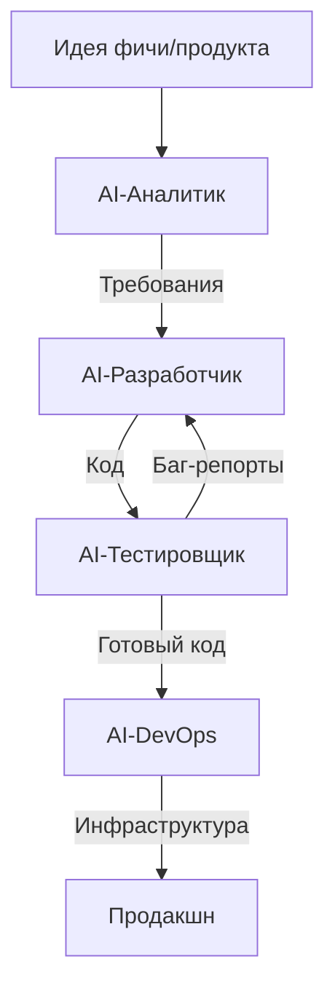
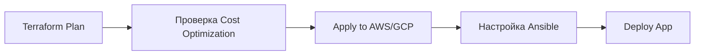
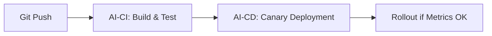
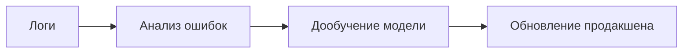

**фазы управления где  роли (разработчик, тестировщик, аналитик, DevOps) заменены AI-агентом**, включая автоматизацию инфраструктуры.
Важным элементом конструкции является обязательный код ревью перед мержем в мастер ветку после каждой стадии [см. на работу агента](AIagent.md) 

---

### **1. Процесс разработки (AI-Driven SDLC)**


#### **Роли AI-агентов:**
| Роль | Функции | Инструменты |
|------|---------|-------------|
| **AI-Аналитик** | – Генерация ТЗ из текста<br>– Разбивка на задачи (Jira/GitLab Issues)<br>– Прогноз сроков | GPT-4, Claude, RPA |
| **AI-Разработчик** | – Написание кода (Python/Go/etc.)<br>– Рефакторинг<br>– Автокоммиты в Git | GitHub Copilot, CodeLlama, SonarQube |
| **AI-Тестировщик** | – Генерация тестов (Unit/E2E)<br>– Прогон в CI/CD<br>– Анализ уязвимостей | Selenium AI, PyTest, OWASP ZAP |
| **AI-DevOps** | – Развертывание инфраструктуры<br>– Мониторинг и алерты<br>– Автоскейлинг | Terraform, Ansible, Kubernetes |

---

### **2. Инфраструктура как код (IaC)**
AI-DevOps автоматически управляет облаком с помощью:


#### **Пример кода от AI:**
```hcl
# main.tf (генерируется AI)
module "k8s_cluster" {
  source = "terraform-aws-modules/eks/aws"
  cluster_name = "ai-prod-cluster"
  node_count   = 3
  auto_scale  = true # AI сам решает, когда масштабировать
}
```

```yaml
# ansible/playbook.yml (генерируется AI)
- name: Configure Nginx
  hosts: webservers
  tasks:
    - apt: name=nginx state=latest
    - template: src=nginx.conf.j2 dest=/etc/nginx/conf.d/default.conf
      notify: restart nginx
```

---

### **3. CI/CD Pipeline (Полностью автономный)**


#### **Этапы пайплайна:**
1. **Сборка**:  
   ```bash
   # AI генерирует этот шаг на основе кода
   docker build -t ai-service:$(git rev-parse --short HEAD) .
   ```
2. **Тесты**:  
   – Автоматическое создание PyTest-скриптов.  
   – Проверка уязвимостей (Trivy + Grype).  
3. **Деплой**:  
   – AI выбирает стратегию (Blue-Green или Rolling).  
   – Мониторинг через Prometheus/Grafana.  

---

### **4. Мониторинг и Алерты**
AI-DevOps использует:
- **Логи**: ELK Stack (автонастройка парсеров).  
- **Метрики**: Prometheus + автоопределение порогов для алертов.  
- **Пример алерта от AI**:  
  ```python
  if cpu_usage > 90% for 5m:
      auto_scale() or rollback()
  ```

---

### **5. Обратная связь и Обучение**


#### **Как AI улучшает себя:**
1. Анализирует **failed pipelines** и корректирует тесты.  
2. Оптимизирует **Terraform-конфиги** для снижения costs.  
3. Предлагает **архитектурные изменения** (например, переход с EC2 на Lambda).  

---

### **Преимущества такого подхода:**
1. **Скорость**: От идеи до продакшена за часы.  
2. **Масштабируемость**: Один AI-агент = 1000 виртуальных сотрудников.  
3. **Экономия**: Нет зарплат, только облачные ресурсы.  

### **Риски:**
- **Безопасность**: AI может упустить уязвимости (например, в IAM-ролях).  
- **Юридические вопросы**: Кто отвечает за баги?  

> **Итог**: Это DevOps "нулевого касания", где люди только ставят задачи, а AI делает всё остальное. Пока что так работают только экспериментальные проекты вроде **GitHub's AI-powered "Copilot X"**.