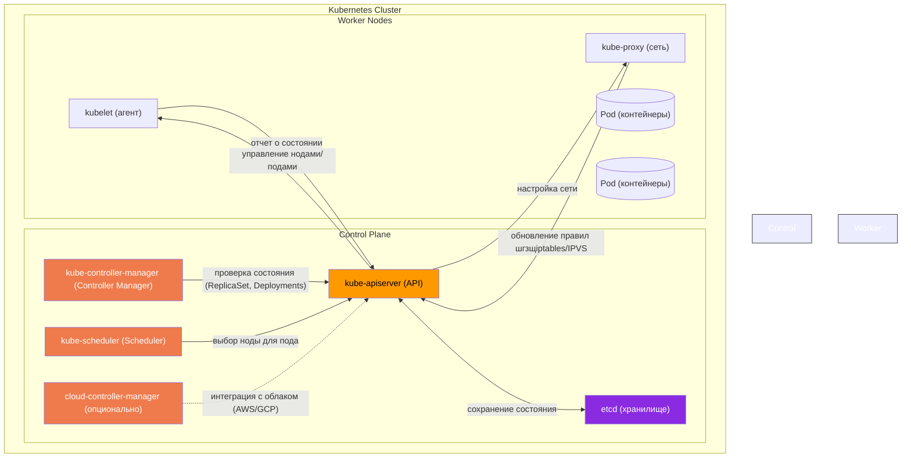
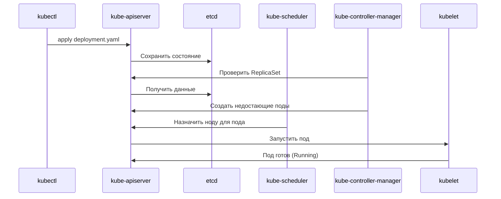

# работа кластера (см. k8s)

### описание компонент и их взаимодействия

| **Компонент**               | **Роль**                                                                 | **Взаимодействие**                                                                 |
|-----------------------------|--------------------------------------------------------------------------|-----------------------------------------------------------------------------------|
| **kube-apiserver (API)**    | Главный интерфейс управления кластером.                                  | 1. Принимает запросы от `kubectl`, Dashboard, CI/CD. 2. Хранит состояние в `etcd`. 3. Отправляет команды `kubelet` и `kube-proxy`. |
| **etcd**                    | Распределенное key-value хранилище состояния кластера.                  | Только API сервер напрямую пишет/читает из etcd. Остальные компоненты работают через API. |
| **kube-controller-manager** | Отслеживает состояние объектов (поды, ноды, сервисы) через API.         | Запускает корректирующие действия (например, рестарт пода при падении). |
| **kube-scheduler**          | Выбирает ноду для запуска пода на основе ресурсов и политик.            | Читает незапланированные поды через API и назначает им ноды. |
| **cloud-controller-manager**| Интегрирует кластер с облачными провайдерами (AWS/GCP/Azure).           | Управляет облачными LB, дисками, нодами через API облака. |
| **kubelet**                 | Агент на нодах, управляет жизненным циклом подов.                       | Получает команды от API, отчитывается о состоянии ноды. |
| **kube-proxy**              | Настраивает сетевые правила (iptables/IPVS) для сервисов.               | Обновляет правила на основе изменений в API (сервисы, эндпоинты). |

### Ключевые взаимодействия:
1. **API ↔ etcd**:  
   - Все изменения (создание пода, обновление деплоймента) сохраняются в etcd.  
   - API сервер — единственный компонент, имеющий доступ к etcd.

2. **API ↔ kubelet**:  
   - `kubelet` запрашивает у API манифесты подов для своей ноды.  
   - Отправляет обратно статус (например, `Running`, `CrashLoopBackOff`).

3. **Controller Manager ↔ API**:  
   - Проверяет, совпадает ли текущее состояние (например, количество реплик) с желаемым.  
   - Если нет — создает/удаляет поды через API.

4. **Scheduler ↔ API**:  
   - Находит поды с `pending` статусом и выбирает для них ноду по критериям:  
     - Достаточно ли CPU/RAM?  
     - Есть ли tolerations к taints?  

5. **kube-proxy ↔ API**:  
   - Следит за изменениями сервисов и эндпоинтов.  
   - Обновляет iptables/IPVS правила для маршрутизации трафика.

### пример последовательности создания пода (деплоя)

### примечания:
- **Безопасность**: Все коммуникации между компонентами используют TLS (кроме etcd → API, если etcd развернут локально).  
- **Масштабируемость**: API сервер можно масштабировать горизонтально, etcd — только odd-количество нод (3, 5, 7).  
- **Расширения**: Доступны дополнительные контроллеры (например, для CRD) и scheduler’ы (например, на основе машинного обучения).