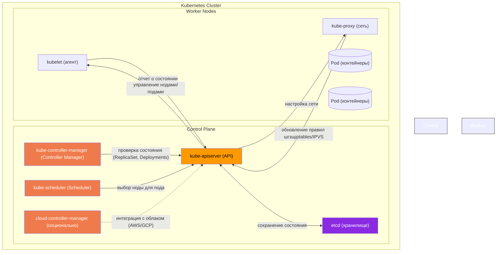

# описание для кластера

```mermaid
flowchart TD
    %% Ноды кластера
    subgraph Kubernetes Cluster
        subgraph Control Plane
            API["kube-apiserver (API)"]
            etcd["etcd (хранилище)"]
            CM["kube-controller-manager (Controller Manager)"]
            Scheduler["kube-scheduler (Scheduler)"]
            CCM["cloud-controller-manager (опционально)"]
        end

        subgraph Worker Nodes
            Kubelet1["kubelet (агент)"]
            KubeProxy1["kube-proxy (сеть)"]
            Pod1[("Pod (контейнеры)")]
            Pod2[("Pod (контейнеры)")]
        end
    end

    %% Взаимодействие
    API <-->|"сохранение состояния"| etcd
    API -->|"управление нодами/подами"| Kubelet1
    API -->|"настройка сети"| KubeProxy1

    CM -->|"проверка состояния (ReplicaSet, Deployments)"| API
    Scheduler -->|"выбор ноды для пода"| API
    CCM -.->|"интеграция с облаком (AWS/GCP)"| API

    Kubelet1 -->|"отчет о состоянии"| API
    KubeProxy1 -->|"обновление правил шгзщiptables/IPVS"| API

    %% Стилизация
    style Control Plane fill:#326ce5,color:white,stroke:#333
    style Worker Nodes fill:#60b932,color:white,stroke:#333
    style API fill:#ff9900,color:black
    style etcd fill:#8a2be2,color:white
    style CM fill:#ef7b4d,color:white
    style Scheduler fill:#ef7b4d,color:white
    style CCM fill:#ef7b4d,color:white
```
