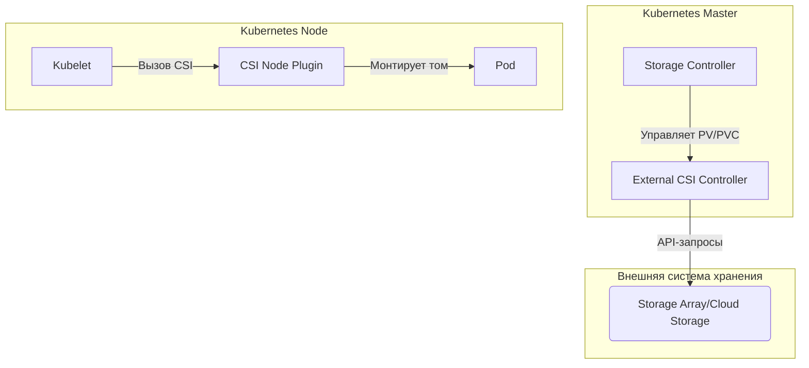

## **1. Что такое CSI и зачем он нужен?**
**CSI (Container Storage Interface)** — стандартный интерфейс для интеграции внешних систем хранения (SAN, NAS, облачные диски) с Kubernetes. До CSI использовались in-tree volume-драйверы (жёстко встроенные в код Kubernetes), что ограничивало гибкость.

### **🔹 Задачи CSI**
- **Динамический провиженинг** томов (автоматическое создание PVC → PV).
- **Подключение/отключение** дисков к Pod'ам.
- **Снапшоты и клонирование** томов.
- **Резервное копирование** данных.

---

## **2. Архитектура CSI**
CSI состоит из **3 основных компонентов**:



### **🔹 Компоненты CSI**
| Компонент | Где работает | Роль |
|-----------|-------------|------|
| **CSI Driver** | Внешний плагин | Главный компонент, реализует логику работы с хранилищем. |
| **External Provisioner** | Sidecar-контейнер | Создает/удаляет тома (PVC → PV). |
| **External Attacher** | Sidecar-контейнер | Подключает том к ноде. |
| **Node Plugin** | На каждой ноде | Монтирует том в Pod (`/var/lib/kubelet/plugins/`). |

---

## **3. Как работает подключение тома?**
### **🔹 Последовательность действий**
1. **Пользователь создает `PersistentVolumeClaim` (PVC)**  
   ```yaml
   apiVersion: v1
   kind: PersistentVolumeClaim
   metadata:
     name: my-pvc
   spec:
     storageClassName: csi-aws-ebs  # Используется CSI-драйвер
     accessModes: [ "ReadWriteOnce" ]
     resources:
       requests:
         storage: 10Gi
   ```
2. **External Provisioner замечает PVC и создает том через CSI Driver**  
   - Драйвер вызывает API облака (например, AWS EBS, GCP Persistent Disk).
3. **Создается `PersistentVolume` (PV)**  
   ```bash
   kubectl get pv
   ```
4. **Kubelet на ноде вызывает Node Plugin**  
   - Том монтируется в `/var/lib/kubelet/pods/<pod-id>/volumes/`.
5. **Pod запускается с подключенным томом**  
   ```yaml
   volumes:
     - name: my-storage
       persistentVolumeClaim:
         claimName: my-pvc
   ```

---

## **4. Основные сценарии работы CSI**
### **🔹 1. Динамический провиженинг**
- PVC → CSI Driver → Облачный API → PV.
- **Пример**: автоматическое создание диска в AWS EBS.

### **🔹 2. Статический провиженинг**
- Админ вручную создает PV, затем PVC привязывается к нему.

### **🔹 3. Снапшоты (Volume Snapshots)**
```yaml
apiVersion: snapshot.storage.k8s.io/v1
kind: VolumeSnapshot
metadata:
  name: my-snapshot
spec:
  volumeSnapshotClassName: csi-aws-vsc
  source:
    persistentVolumeClaimName: my-pvc
```

### **🔹 4. Расширение тома (Volume Expansion)**
- Изменяем `spec.resources.requests.storage` в PVC → CSI Driver расширяет том.

---

## **5. Типичные проблемы и их решения**
| Проблема | Причина | Решение |
|----------|--------|---------|
| **PVC в статусе `Pending`** | Нет доступного StorageClass | Проверить `kubectl get storageclass` |
| **Том не монтируется** | Ошибка CSI-драйвера | Проверить логи `kubectl logs -n kube-system <csi-pod>` |
| **Ошибка `VolumeAttachment`** | Нода недоступна | Перезапустить `kubelet` или CSI-драйвер |
| **Медленные операции** | Проблемы с облачным API | Проверить квоты и лимиты (например, AWS EBS) |
| **Снапшоты не работают** | Не настроен `VolumeSnapshotClass` | Создать правильный `VolumeSnapshotClass` |

---

## **6. Примеры популярных CSI-драйверов**
| Хранилище | CSI Driver | Особенности |
|-----------|------------|-------------|
| **AWS EBS** | `aws-ebs-csi-driver` | Поддержка снапшотов, IOPS-настройки |
| **GCP Persistent Disk** | `pd.csi.storage.gke.io` | Интеграция с Google Cloud |
| **Azure Disk** | `disk.csi.azure.com` | Поддержка Premium SSD |
| **Ceph RBD** | `rbd.csi.ceph.com` | Для on-prem решений |
| **Longhorn** | `driver.longhorn.io` | Распределенное хранилище |

---

## **7. Как проверить работу CSI?**
### **🔹 Команды для диагностики**
```bash
# Проверить StorageClass
kubectl get storageclass

# Проверить PVC/PV
kubectl get pvc
kubectl get pv

# Логи CSI-драйвера
kubectl -n kube-system logs -l app=csi-aws-ebs-controller

# Проверить VolumeAttachment
kubectl get volumeattachment
```

### **🔹 Пример рабочего CSI (AWS EBS)**
```yaml
apiVersion: storage.k8s.io/v1
kind: StorageClass
metadata:
  name: ebs-sc
provisioner: ebs.csi.aws.com
volumeBindingMode: WaitForFirstConsumer  # Том создается при запуске Pod
```

---
- **CSI** — стандартный способ подключения внешних хранилищ в Kubernetes.
- **Основные компоненты**: Driver, External Provisioner, Node Plugin.
- **Решает проблемы** динамического провиженинга, снапшотов и расширения томов.
- **Для продакшена** выбирайте драйвер, соответствующий вашему хранилищу (AWS/GCP/Azure/Ceph).

Если CSI не работает — в первую очередь проверяйте **логи драйвера** и **статус PVC/PV**.