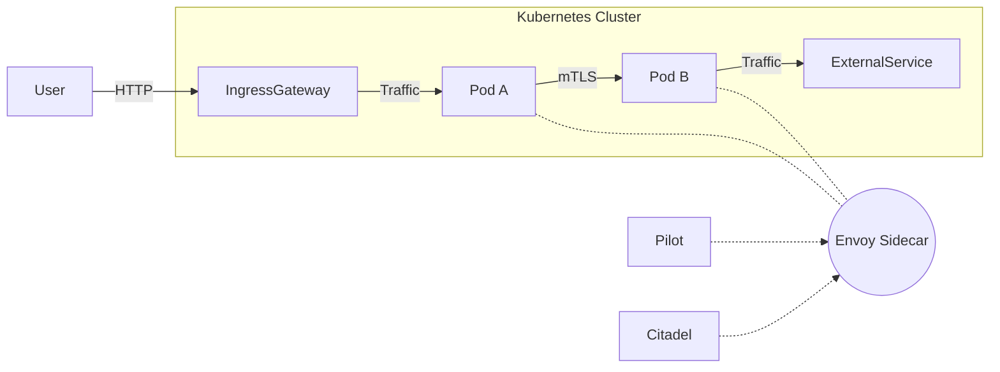

# **Service Mesh на примере Istio: принцип работы, архитектура и примеры**

Service Mesh (сервисная сетка) — это инфраструктурный слой для управления коммуникацией между микросервисами. **Istio** — один из самых популярных сервис-мешей, работающий поверх Kubernetes.  

---

## **🔹 Как работает Istio?**  
Istio внедряется в кластер Kubernetes и перехватывает весь трафик между подами с помощью **sidecar-прокси (Envoy)**.  

### **1. Ключевые компоненты**  
| Компонент | Роль |  
|-----------|------|  
| **Envoy** | Sidecar-прокси в каждом поде, управляющий входящим/исходящим трафиком. |  
| **Pilot** | Контроллер, который конфигурирует Envoy (маршрутизация, балансировка). |  
| **Citadel** | Управляет TLS-сертификатами для mTLS (взаимная аутентификация). |  
| **Galley** | Валидирует конфигурации Istio. |  

---

## **🔹 Архитектура Istio**  



1. **Sidecar-инъекция**:  
   В каждый под внедряется контейнер `istio-proxy` (Envoy), который перехватывает трафик.  

2. **Управление трафиком**:  
   - **Pilot** сообщает Envoy, куда направлять запросы (A/B-тестирование, canary-деплой).  
   - **Citadel** обеспечивает mTLS (шифрование трафика между сервисами).  

3. **Наблюдаемость**:  
   - Метрики (Prometheus), логи (Loki/Kiali), трейсинг (Jaeger/Zipkin).  

---

## **🔹 Пример 1: Включение Istio в Kubernetes**  

### **1. Установка Istio**  
```bash
# Скачиваем istioctl
curl -L https://istio.io/downloadIstio | sh -
cd istio-*
export PATH=$PWD/bin:$PATH

# Устанавливаем Istio в кластер
istioctl install --set profile=demo -y
```

### **2. Включение sidecar-инъекции для неймспейса**  
```bash
kubectl label namespace default istio-injection=enabled
```

### **3. Проверка**  
```bash
kubectl get pods -n default
# Должен быть дополнительный контейнер `istio-proxy` в каждом поде.
```

---

## **🔹 Пример 2: Маршрутизация трафика (Canary-деплой)**  

### **1. Развертывание двух версий сервиса**  
```yaml
apiVersion: apps/v1
kind: Deployment
metadata:
  name: frontend-v1
spec:
  replicas: 3
  template:
    spec:
      containers:
      - name: frontend
        image: nginx:1.25
---
apiVersion: apps/v1
kind: Deployment
metadata:
  name: frontend-v2
spec:
  replicas: 1
  template:
    spec:
      containers:
      - name: frontend
        image: nginx:1.26
```

### **2. Настройка VirtualService и DestinationRule**  
```yaml
apiVersion: networking.istio.io/v1alpha3
kind: VirtualService
metadata:
  name: frontend
spec:
  hosts:
  - frontend.default.svc.cluster.local
  http:
  - route:
    - destination:
        host: frontend.default.svc.cluster.local
        subset: v1
      weight: 90  # 90% трафика на v1
    - destination:
        host: frontend.default.svc.cluster.local
        subset: v2
      weight: 10  # 10% трафика на v2
---
apiVersion: networking.istio.io/v1alpha3
kind: DestinationRule
metadata:
  name: frontend
spec:
  host: frontend.default.svc.cluster.local
  subsets:
  - name: v1
    labels:
      version: v1
  - name: v2
    labels:
      version: v2
```

**Результат**:  
- 90% трафика → `frontend-v1`.  
- 10% трафика → `frontend-v2`.  

---

## **🔹 Пример 3: mTLS (взаимная аутентификация)**  
Istio автоматически включает mTLS между сервисами.  

### **1. Проверка TLS**  
```bash
kubectl exec -it frontend-v1-xxxxx -c istio-proxy -- curl -v http://backend:8080
# В логах будет:  
# * ALPN, offering h2  
# * TLSv1.2 (IN), TLS handshake, Finished (20)  
```

### **2. Отключение mTLS для определенного сервиса**  
```yaml
apiVersion: security.istio.io/v1beta1
kind: PeerAuthentication
metadata:
  name: backend-mtls-off
spec:
  selector:
    matchLabels:
      app: backend
  mtls:
    mode: DISABLE
```

---

## **🔹 Пример 4: Наблюдаемость (Kiali + Prometheus + Jaeger)**  

### **1. Установка аддонов**  
```bash
kubectl apply -f samples/addons/kiali.yaml
kubectl apply -f samples/addons/prometheus.yaml
kubectl apply -f samples/addons/jaeger.yaml
```

### **2. Доступ к Kiali**  
```bash
istioctl dashboard kiali
```
**Что можно увидеть**:  
- Карту сервисов (граф зависимостей).  
- HTTP-метрики (RPS, latency, ошибки).  
- Трассировки запросов (Jaeger).  

---

## **🔹 Проблемы и решения**  

| **Проблема** | **Решение** |  
|--------------|------------|  
| Sidecar не внедряется | Проверить `istio-injection` в неймспейсе: `kubectl get namespace -L istio-injection`. |  
| 503 ошибки между сервисами | Проверить mTLS (`PeerAuthentication`) и `DestinationRule`. |  
| Нет метрик в Kiali | Убедиться, что Prometheus и Kiali работают (`kubectl get pods -n istio-system`). |  

---

## **🔹 Вывод**  
- **Istio** — это **service mesh**, который управляет трафиком между микросервисами через sidecar-прокси (Envoy).  
- **Основные функции**:  
  - Маршрутизация (A/B-тестирование, canary).  
  - Безопасность (mTLS, RBAC).  
  - Наблюдаемость (метрики, логи, трейсинг).  
- **Примеры использования**:  
  - Постепенный деплой (Canary).  
  - Автоматическое шифрование трафика (mTLS).  
  - Визуализация зависимостей сервисов (Kiali).  

**Когда использовать Istio?**  
✅ Есть **много микросервисов** в Kubernetes.  
✅ Нужен **контроль над трафиком** (например, для плавного деплоя).  
✅ Требуется **сквозное шифрование (mTLS)**.