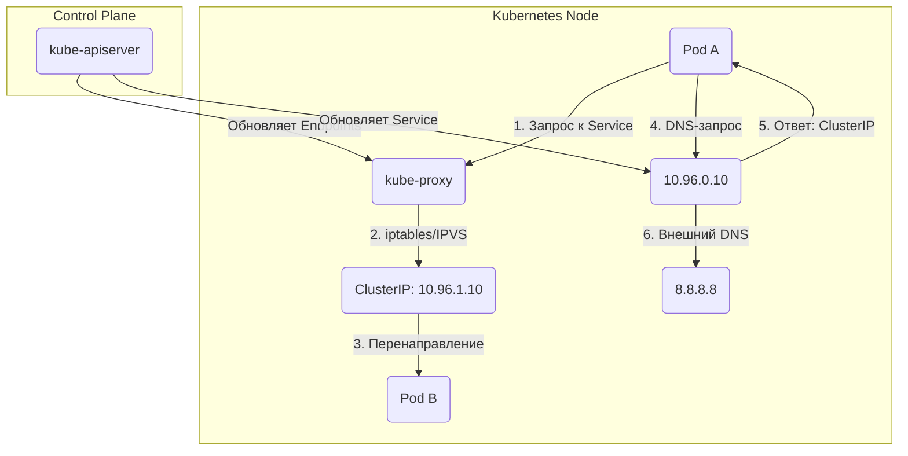

# **Принцип работы kube-proxy и CoreDNS в Kubernetes**

## **1. Kube-proxy: как работает и за что отвечает?**

**Kube-proxy** — это компонент Kubernetes, который обеспечивает сетевую коммуникацию между **Pods**, **Services** и внешним миром. Он работает на каждой ноде кластера.

Kubernetes использует **плоскую (flat) сетевую модель**, где:
- **Каждый Pod получает уникальный IP** (из диапазона CNI-плагина, например, `10.244.0.0/16`).
- **Pod'ы могут общаться друг с другом напрямую** без NAT (даже если находятся на разных нодах).
- **Service'ы получают виртуальный IP (ClusterIP)**, который балансируется через `kube-proxy`.

CoreDNS — стандартный DNS-сервер в Kubernetes, заменяющий `kube-dns`. Он резолвит имена в формате:
- `<service>.<namespace>.svc.cluster.local` → ClusterIP сервиса.
- `<pod-ip>.<namespace>.pod.cluster.local` → IP Pod'а (обратный запрос).

### **🔹 Основные задачи kube-proxy**
1. **Трансляция Service → Pod**  
   - Преобразует виртуальный IP (`ClusterIP`) в реальные IP Pod'ов.
2. **Балансировка нагрузки**  
   - Распределяет трафик между Pod'ами сервиса.
3. **Поддержка Service Types**  
   - `ClusterIP`, `NodePort`, `LoadBalancer`, `ExternalName`.

### **🔹 Режимы работы kube-proxy**
| Режим | Принцип работы | Плюсы | Минусы |
|-------|---------------|-------|--------|
| **iptables** (по умолчанию) | Правила `iptables` для маршрутизации | Надежность | Медленный при 1000+ сервисах |
| **IPVS** (рекомендуется) | Использует ядерный L4-балансировщик (`ip_vs`) | Высокая производительность | Требует `ip_vs` в ядре |
| **userspace** (устарел) | Проксирование в userspace | Простота | Низкая производительность |

### **🔹 Как kube-proxy обрабатывает запросы?**
1. **Для `ClusterIP`**  
   - Создает iptables/IPVS-правила, которые перенаправляют трафик с `ClusterIP` на Pod'ы.
   - Пример правила iptables:
     ```bash
     iptables -t nat -L KUBE-SERVICES | grep <SERVICE_IP>
     ```
2. **Для `NodePort`**  
   - Открывает порт на всех нодах (`30000-32767`) и перенаправляет его на `ClusterIP`.
3. **Для `LoadBalancer`**  
   - Работает вместе с облачным провайдером (AWS/GCP), создает внешний балансировщик.

---

## **2. CoreDNS: как работает DNS в Kubernetes?**

**CoreDNS** — это гибкий DNS-сервер, который заменяет `kube-dns` в современных кластерах. Он отвечает за:
- **Резолвинг имен сервисов** (`<service>.<namespace>.svc.cluster.local`).
- **Обратные запросы** (PTR-записи для IP).
- **Интеграцию с внешними DNS** (например, корпоративными).

### **🔹 Основные компоненты CoreDNS**
1. **CoreDNS Pod**  
   - Запускается в пространстве имен `kube-system`.
   - Конфигурация хранится в `ConfigMap`:
     ```bash
     kubectl -n kube-system get configmap coredns -o yaml
     ```
2. **Kube-DNS Service**  
   - Имеет статический IP (`10.96.0.10` по умолчанию), прописанный в `/etc/resolv.conf` каждого Pod'а.

### **🔹 Как CoreDNS обрабатывает запросы?**
1. **Запрос из Pod'а**  
   - Pod отправляет DNS-запрос (`nginx.default.svc.cluster.local`) в `10.96.0.10`.
2. **CoreDNS проверяет зоны**  
   - Если имя в формате `<service>.<ns>.svc`, возвращает `ClusterIP` сервиса.
   - Если имя внешнее (например, `google.com`), делегирует запрос вышестоящему DNS.
3. **Кеширование**  
   - CoreDNS кеширует ответы для ускорения последующих запросов.

---

## **3. Схема взаимодействия kube-proxy и CoreDNS**



### **Пояснение к схеме**
1. **Pod → Service**  
   - Pod делает запрос к `nginx.default.svc.cluster.local`.
   - CoreDNS возвращает `ClusterIP` (например, `10.96.1.10`).
   - kube-proxy перенаправляет трафик на реальный Pod через iptables/IPVS.
2. **Pod → External Service**  
   - Если имя не из `.svc`, CoreDNS делегирует запрос внешнему DNS (например, `8.8.8.8`).
3. **Обновление правил**  
   - При изменении Service/Endpoints, kube-apiserver уведомляет kube-proxy и CoreDNS.

---

## **4. Примеры команд для диагностики**
### **🔹 Проверить kube-proxy**
```bash
# Посмотреть режим работы
kubectl -n kube-system get ds kube-proxy -o yaml | grep mode

# Логи kube-proxy
kubectl -n kube-system logs -l k8s-app=kube-proxy
```

### **🔹 Проверить CoreDNS**
```bash
# Посмотреть DNS-конфигурацию Pod'а
kubectl exec -it <pod> -- cat /etc/resolv.conf

# Проверить работу CoreDNS
kubectl -n kube-system logs -l k8s-app=kube-dns

# Тестовый DNS-запрос
kubectl run -it --rm --image=alpine test -- sh
ping nginx.default.svc.cluster.local
```

---

## **5. Проблемы и решения**
| Проблема | Решение |
|----------|---------|
| **Сервис не резолвится** | Проверить CoreDNS (`kubectl get pods -n kube-system`). |
| **Трафик не идет к Pod'ам** | Проверить kube-proxy и Endpoints (`kubectl get endpoints`). |
| **Медленные DNS-запросы** | Увеличить кеш CoreDNS (опция `cache` в ConfigMap). |
| **Нет доступа к внешним DNS** | Проверить `ndots` в `/etc/resolv.conf` Pod'а. |

---

- **kube-proxy** отвечает за маршрутизацию трафика к Pod'ам через `iptables`/`IPVS`.
- **CoreDNS** обеспечивает DNS-резолвинг для сервисов (`<service>.<ns>.svc`).
- Оба компонента критичны для работы Service'ов в Kubernetes.
- Для оптимизации:
  - Используйте **IPVS** вместо iptables (если >1000 сервисов).
  - Настройте **кеширование** в CoreDNS.


### **🔹 Конфигурация CoreDNS**
Файл конфигурации хранится в ConfigMap:
```bash
kubectl -n kube-system get configmap coredns -o yaml
```
Пример конфига:
```yaml
apiVersion: v1
data:
  Corefile: |
    .:53 {
        errors
        health
        ready
        kubernetes cluster.local in-addr.arpa ip6.arpa {  # Резолвинг Kubernetes-сервисов
           pods verified
           fallthrough in-addr.arpa ip6.arpa
        }
        forward . /etc/resolv.conf  # Внешние запросы делегируются вышестоящему DNS
        cache 30
        loop
        reload
    }
```

---

## **Дополнительная информация. Как резолвятся FQDN (полные доменные имена)?**
### **🔹 Внутри кластера**
1. **Для Service'ов**:
   - Запрос: `nginx.default.svc.cluster.local` → CoreDNS → `ClusterIP` сервиса.
   - Если namespace не указан (`nginx`), используется namespace Pod'а.

2. **Для Pod'ов**:
   - Запрос: `10-244-0-5.default.pod.cluster.local` → IP `10.244.0.5`.
   - Имя Pod'а преобразуется в DNS-формат (например, `10-244-0-5` вместо `10.244.0.5`).

3. **Для ExternalName-сервисов**:
   ```yaml
   kind: Service
   apiVersion: v1
   metadata:
     name: my-db
   spec:
     type: ExternalName
     externalName: db.example.com  # CoreDNS вернет CNAME-запись
   ```
   - Запрос: `my-db.default.svc.cluster.local` → `db.example.com`.

### **🔹 Внешние DNS-запросы**
- Если имя не принадлежит домену `cluster.local`, CoreDNS перенаправляет запрос на DNS из `/etc/resolv.conf` Pod'а.
- Пример:
  ```bash
  kubectl exec -it my-pod -- cat /etc/resolv.conf
  ```

## **Типичные проблемы и решения**
| Проблема | Диагностика | Решение |
|----------|-------------|---------|
| **DNS-запросы не работают** | `kubectl exec -it my-pod -- nslookup google.com` | Проверить CoreDNS (`kubectl -n kube-system logs coredns-...`). |
| **Service не резолвится** | `nslookup nginx.default.svc.cluster.local` | Убедиться, что сервис существует (`kubectl get svc`). |
| **Медленные DNS-запросы** | `kubectl -n kube-system describe configmap/coredns` | Увеличить `cache` в CoreDNS. |
| **Трафик не доходит до Pod'ов** | `kubectl get endpoints` | Проверить, есть ли Pod'ы у сервиса. |

---

## **Примеры DNS-запросов**
```bash
# Запрос из Pod'а к сервису
kubectl exec -it my-pod -- curl http://nginx.default.svc.cluster.local

# Ручной DNS-запрос
kubectl exec -it my-pod -- nslookup nginx.default.svc.cluster.local

# Проверка внешнего DNS
kubectl exec -it my-pod -- ping google.com
```

---

- **Сеть в Kubernetes** основана на **CNI-плагинах** и **kube-proxy**.
- **CoreDNS** резолвит имена сервисов в формате `<service>.<ns>.svc.cluster.local`.
- **FQDN-резолвинг** зависит от:
  - Настроек `/etc/resolv.conf` Pod'а.
  - Количества точек в имени (`ndots`).
  - Приоритета `search`-доменов.
- Для диагностики используйте **nslookup**, **dig** и **логи CoreDNS**.
